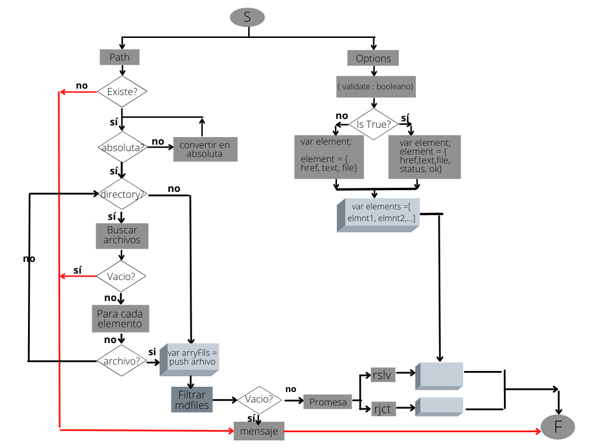
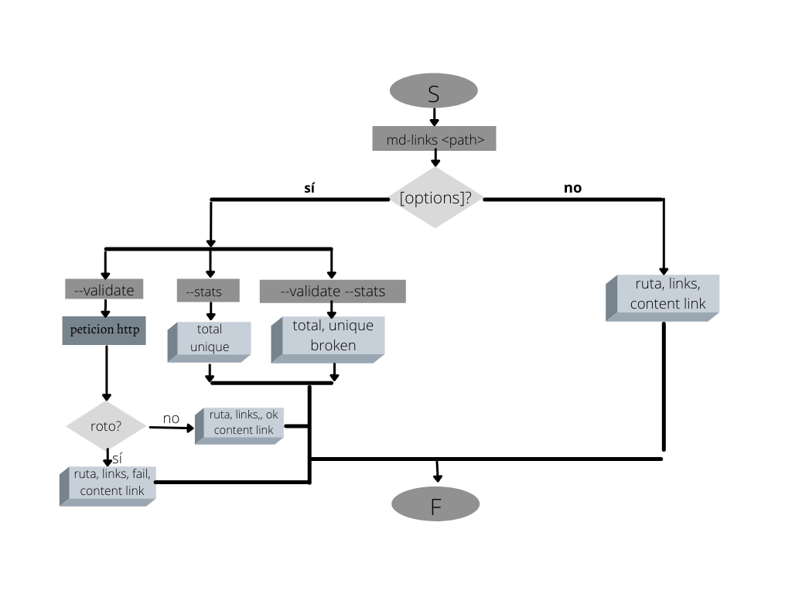
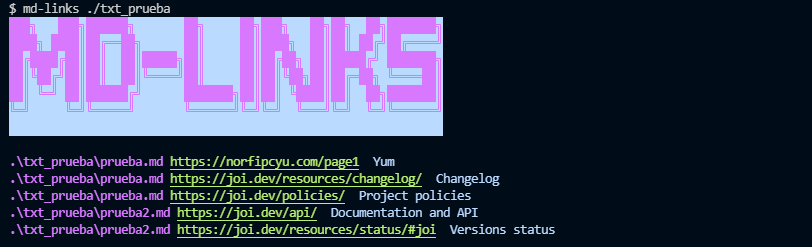
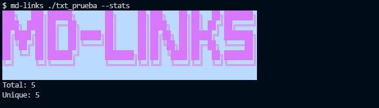
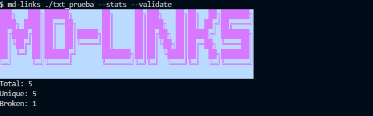
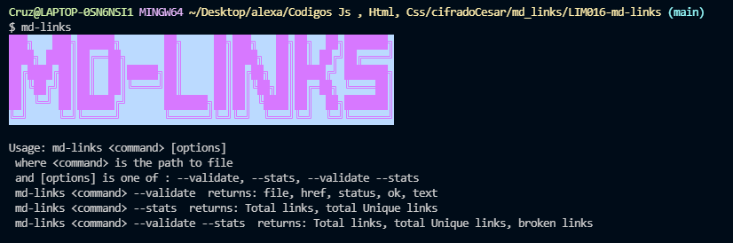
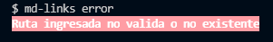

# Markdown Links

## Índice

* [1. Preámbulo](#1-preámbulo)
* [2. Proyección del proyecto](#2-consideraciones-generales)
* [3. Documentación](#3-documentación-usada-en-la-creación)
* [4. Instalación](#4-instalación)
* [5. Autora](#6-autora)

***

## 1. Preámbulo

[Markdown](https://es.wikipedia.org/wiki/Markdown) es un lenguaje de marcado
ligero muy popular entre developers. Es usado en muchísimas plataformas que
manejan texto plano (GitHub, foros, blogs, ...), y es muy común
encontrar varios archivos en ese formato en cualquier tipo de repositorio
(empezando por el tradicional `README.md`).

Estos archivos `Markdown` normalmente contienen _links_ (vínculos/ligas) que
muchas veces están rotos o ya no son válidos y eso perjudica mucho el valor de
la información que se quiere compartir.

Dentro de una comunidad de código abierto, nos han propuesto crear una
herramienta usando [Node.js](https://nodejs.org/), que lea y analice archivos
en formato `Markdown`, para verificar los links que contengan y reportar
algunas estadísticas.

Este proyecto fue creado por <a href="https://www.laboratoria.la">Laboratoria</a> Bootcamp - Lima 016 💛

***

## 2. Proyección del proyecto

Para que el usuario entienda mejor la construccion de la funcion md-links y del CLI, tenemos el contenido del proyecto plasmado en los siguientes diagramas de flujo

Diagrama API



Diagrama CLI



***

## 3. Documentacion usada en la creacion de CLI
* [Node.js](https://nodejs.org/en/) - Used to create the library
* [CommonJS](https://nodejs.org/docs/latest/api/modules.html#modules-commonjs-modules) - Handle modules
* [NPM](https://www.npmjs.com/) - Manage packages
* [node-fetch](https://www.npmjs.com/package/node-fetch) - Make HTTP calls
* [showdown](https://github.com/showdownjs/showdown) - Javascript Markdown to HTML converter
* [JSDOM](https://github.com/jsdom/jsdom) - Used to get links
* [Figlet](https://github.com/patorjk/figlet.js) - Generate banner
* [Chalk](https://github.com/chalk/chalk) - Used to style terminal output

***

## 4. Instalación

Consulte Implementación de la biblioteca desarrollada con Node.js.

El usuario puede instalar la biblioteca mediante la siguiente entrada

```
$ npm install <>
```
Estas instrucciones le permitirán instalar la biblioteca en su máquina local para el desarrollo.

### Guía de Uso
El usuario puede ejecutar la biblioteca a través de su consola mediante la siguiente linea de comando:

```
md-links <path-to-file> [options]
```

Las rutas ingresadas ( paths ) pueden ser  **relativas** o **absolutas** y las opciones a usar por el usuario son: `--help`, `--stats`, `--validate`, o puede usar ambos `--stats --validate`.

Caso 1: `md-links <path-to-file>`



Caso 2: `md-links <path-to-file> --validate`


Case 3: `md-links <path-to-file> --stats`



Case 4: `md-links <path-to-file> --stats --validate` o `md-links <path-to-file> --validate --stats`



Case 5: `md-links --help` o `md-links`



Case 6: Cuando es una entrada incorrecta en el terminal



***

## 5. Autora 
[Yumari Cruz Reyes](https://github.com/Yumari081196)